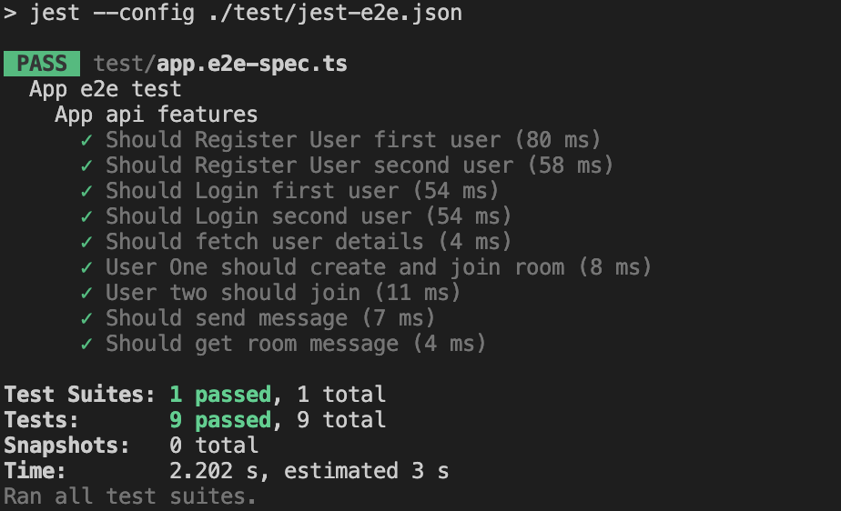
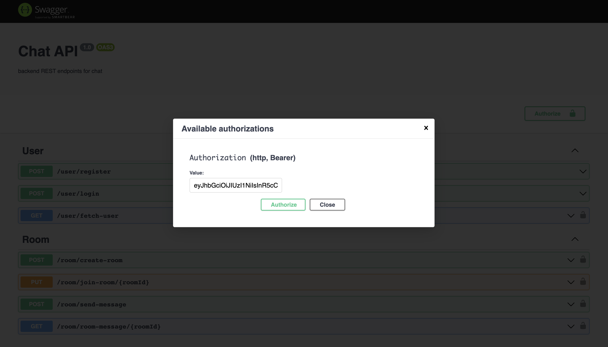

## Description
Chat REST API

## Installation

```bash
$ yarn install
```

## Running the app
To start server in a docker container
```bash
$ docker-compose build

$ docker-compose up
```
## Running the test
```bash
# To run e2e test
# Set node_env to test 
$ npm run test:e2e
```


## Openai(Swagger) documentation
url : http://localhost:3000/api

To set Authentication, click on the authorize button and paste the jwt token

